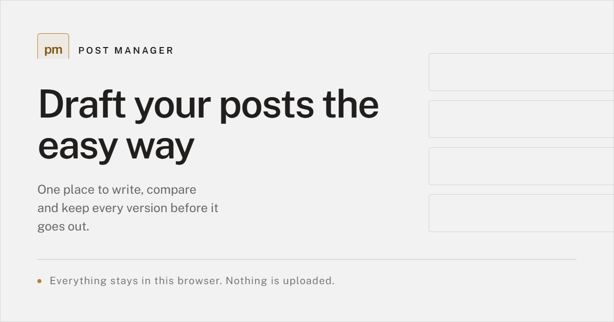
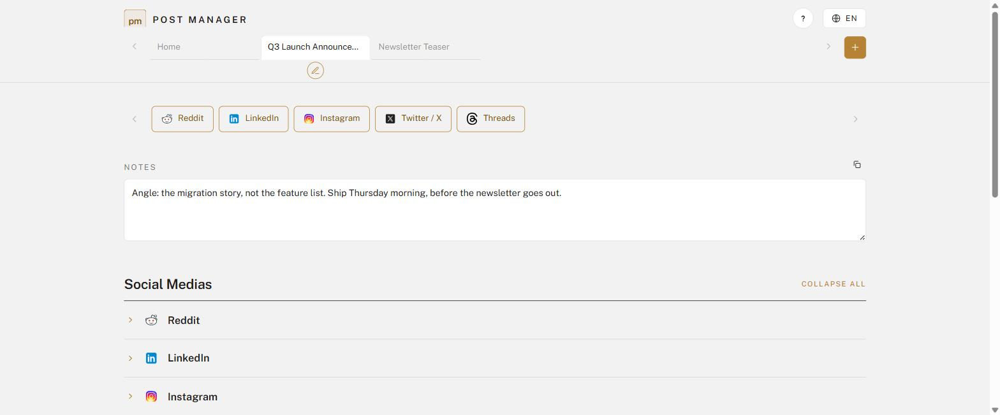
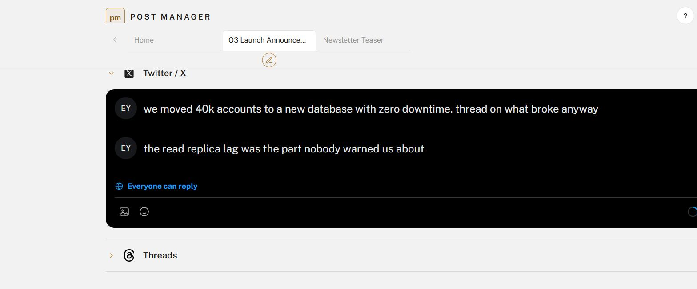

<div align="center">



<br>

**One idea. Five composers. Zero accounts.**

Write a post once and shape it for every platform side by side, in a page that looks like the place it is going.

[](LICENSE)
[](https://astro.build)
[](https://www.typescriptlang.org)
[](https://post-manager.vercel.app)

</div>

<br>

## The problem

The same announcement needs five shapes. Reddit wants a title and a body. LinkedIn wants a story. X wants 280 characters and a thread. You end up with five half-finished drafts in five browser tabs, and no way to see them next to each other.

Post Manager puts them on one page.

<br>



<br>
<br>

## Five composers, rebuilt

Each one is a close copy of the real editor, so you write with the right shape in mind instead of guessing.

| | Platform | What it gives you |
| :--: | --- | --- |
|  | **Reddit** | Subreddit picker, flair and NSFW tags, rich body, link and media rules that lock each other the way Reddit's do |
|  | **LinkedIn** | The composer and the media editor, emoji keyboard, 3,000 character mark |
|  | **Instagram** | Crop step, carousel, caption counter, alt text, and the full settings drawer |
|  | **Twitter / X** | The character ring, four images a post, and a real thread chain |
|  | **Threads** | Topic line and a thread chain of its own |

<br>



<br>
<br>

## Nothing leaves your browser

No account. No database. No analytics.

- **Your drafts live in `localStorage`.** Close the tab, come back next week, and every project is where you left it: same tabs, same open composers, same words.
- **Images and video are never saved.** They are held in memory while the page is open and discarded when it closes.
- **The one exception is the contact form**, and only because you pressed send.

<br>

## Built with

**Astro 5** in static mode, so every route is a plain HTML file and there is no client router. **Preact islands** only where state is genuinely required: the tab bar, the workspace, the tour, the contact form. Everything else is markup. **Tailwind 4** for the utility layer, with the design tokens as CSS variables. **TypeScript** in strict mode throughout.

The contact endpoint is a single **Vercel function** guarded by **Cloudflare Turnstile**, a honeypot and a timing check, and it delivers through **Resend**.

<br>

## Running it

```bash
pnpm install
pnpm dev
```

That is enough for everything but the contact form, which needs keys:

```bash
cp .env.example .env.local   # then fill it in
```

| Command | |
| --- | --- |
| `pnpm dev` | development server |
| `pnpm build` | static build, then stamp the security policy |
| `pnpm check` | types and templates |
| `pnpm test` | unit tests |
| `pnpm test:e2e` | flow tests |

Deployment is a static build plus one function on Vercel. The contact endpoint reads four variables from the host: `PUBLIC_TURNSTILE_SITE_KEY`, `TURNSTILE_SECRET_KEY`, `RESEND_API_KEY` and `CONTACT_TO`.

<br>

## License

[MIT](LICENSE) © Taner Talas

<div align="center">
<br>
<sub>Post Manager is a drafting aid. It publishes nothing, and it is not affiliated with any of the platforms it imitates.</sub>
</div>
